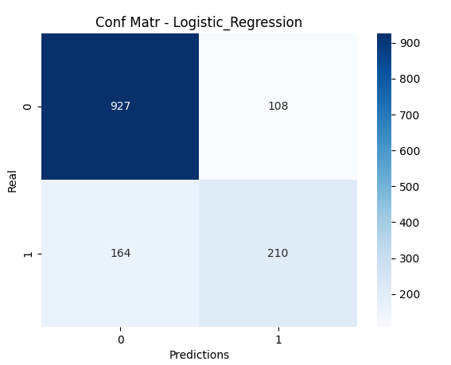
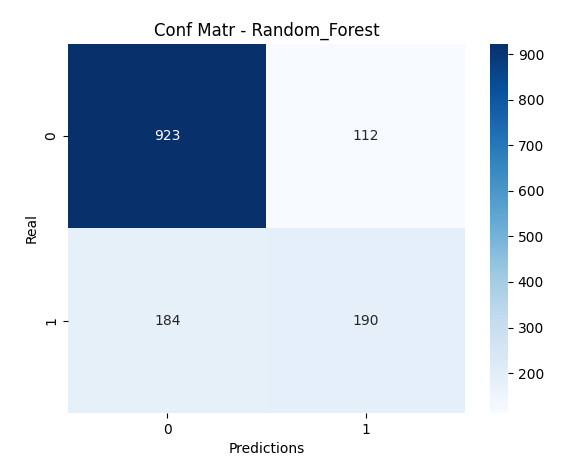

# Telco Customer Churn Prediction

## Overview
This project predicts whether a customer will churn (resign from a telecom service) using machine learning. Multiple classification models are trained and compared, and the trained models are saved for evaluation.  

Dataset: [Telco Customer Churn - Kaggle](https://www.kaggle.com/datasets/blastchar/telco-customer-churn)


---

## Features

### Classification Models Used
- Logistic Regression
- Random Forest

### Preprocessing Pipeline
- Handles missing values:  
  - Numeric: median  
  - Categorical: most frequent
- Feature scaling
- One-hot encoding
- Train/test split with stratification to handle class distribution

---

## Installation

### Clone the repository
```bash
git clone https://github.com/shmahma/CHURN
cd CHURN
```

### Install dependencies
```bash
pip install -r requirements.txt
```


## Usage

### 1️ Train the Model
```bash
python src/train.py
```
- Trains multiple models
- Saves pipelines

### 2️ Predict with Test Data
```bash
python src/evaluate.py 
```
- Produces predictions and generate confusion matrix fo each model
  




